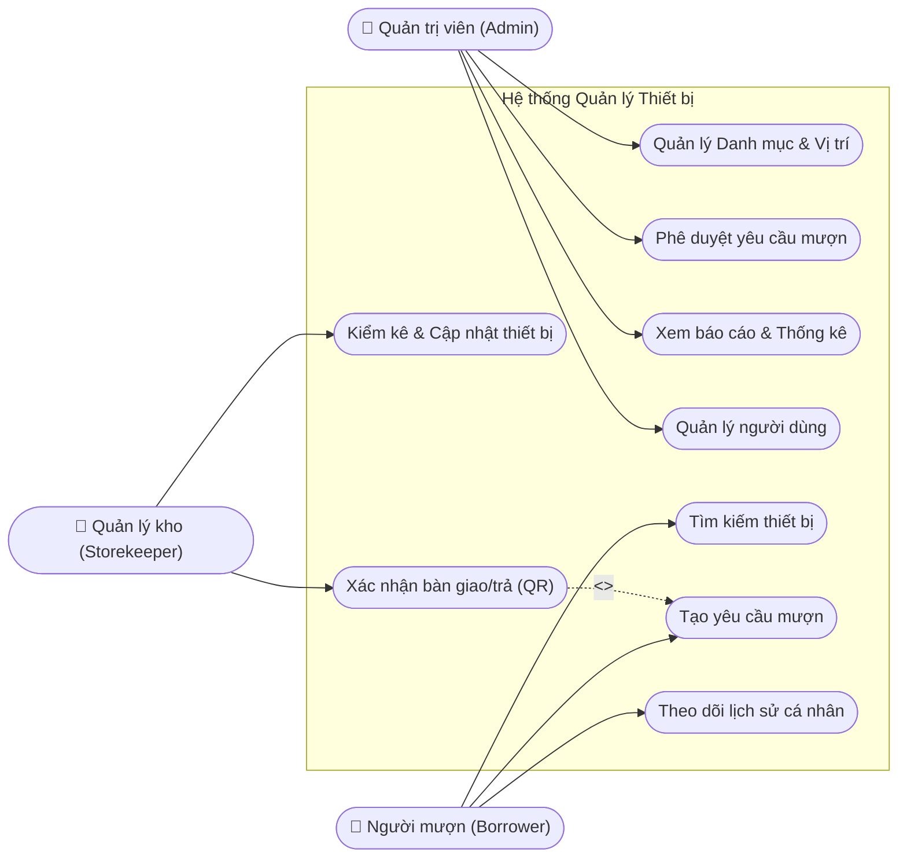
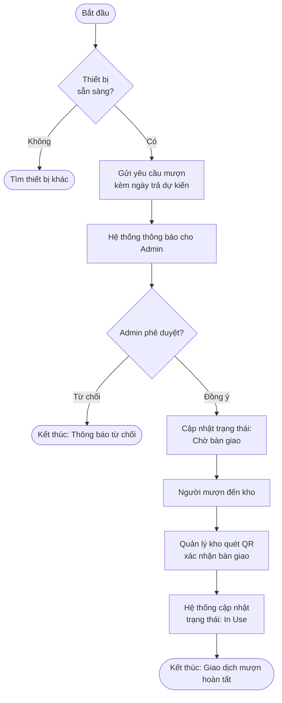
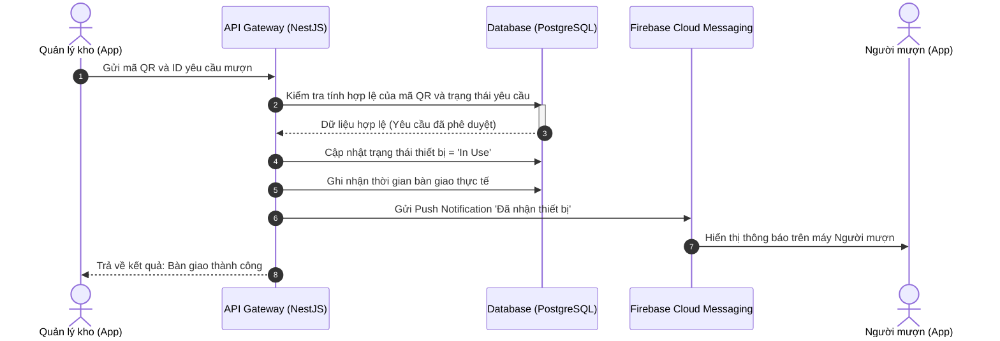
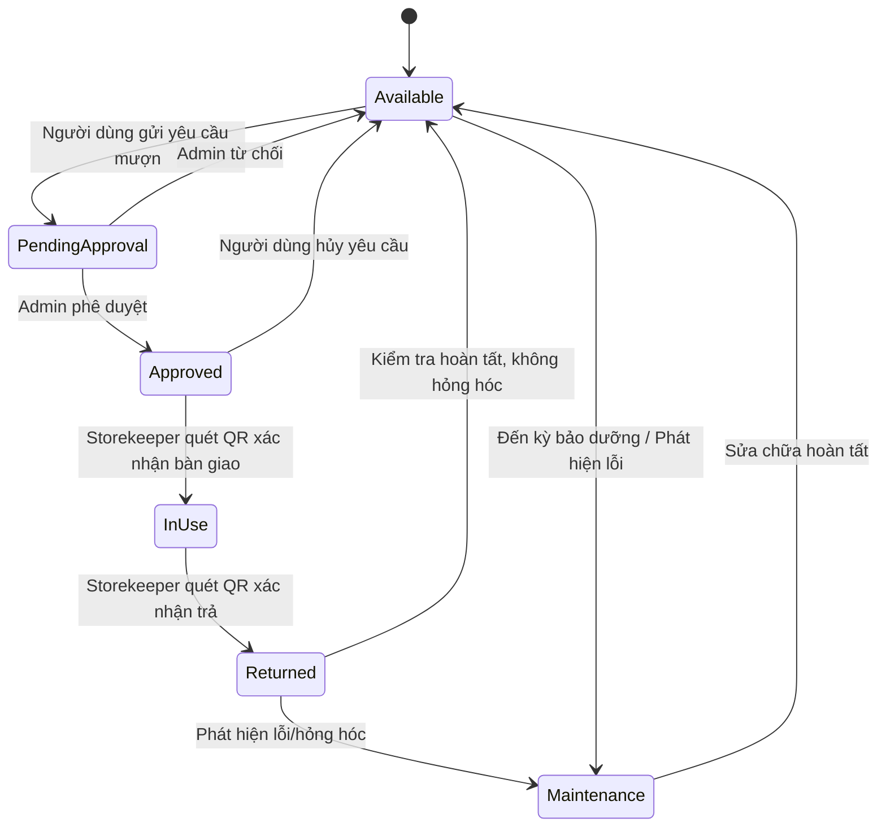
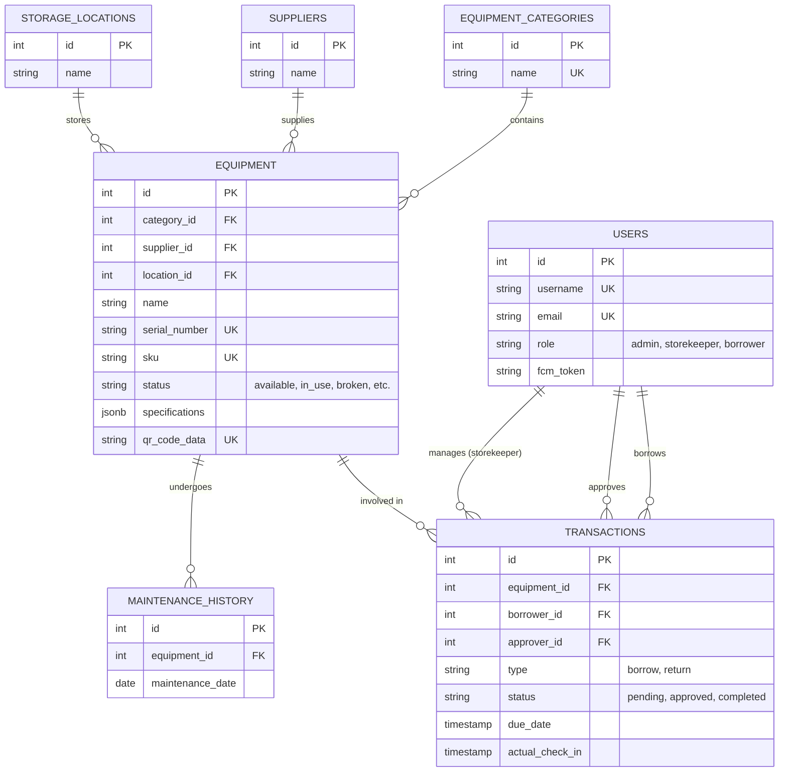

# BẢN MÔ TẢ DỰ ÁN VÀ ĐẶC TẢ YÊU CẦU PHẦN MỀM (SRS)

## 1. Tên dự án
**Hệ thống Quản lý Mượn/Trả Thiết bị Đa nền tảng (Web Portal & Mobile App)**

---

## 2. Tổng quan & Vấn đề cần giải quyết (Problem Statement)

Dự án hướng tới việc số hóa và tự động hóa quy trình mượn, trả và quản lý tài sản/thiết bị trong khuôn khổ Câu lạc bộ hoặc Phòng ban sinh viên. Hiện nay, việc quản lý thủ công (qua giấy tờ hoặc Excel) thường dẫn đến tình trạng thất thoát tài sản, trùng lặp lịch mượn, và khó khăn trong việc theo dõi tình trạng hư hỏng của thiết bị.

Hệ thống được thiết kế theo mô hình **Client-Server Architecture**, sử dụng kiến trúc **Shared Backend** (Dùng chung một nền tảng API Core) để phục vụ đồng thời cho hai Client:
- **Web Portal (Dành cho Ban chủ nhiệm/Admin):** Quản lý tổng thể, phê duyệt đơn, xem thống kê và báo cáo.
- **Mobile App (Dành cho Sinh viên/Thành viên):** Tra cứu lịch trống của thiết bị, tạo đơn mượn nhanh chóng và thực hiện thao tác bàn giao tại kho.

---

## 3. Mục tiêu dự án (Project Objectives)

- **Quản trị tài sản chặt chẽ (Asset Control):** Kiểm soát chính xác vòng đời trạng thái của thiết bị (Tồn kho -> Chờ duyệt -> Đang mượn -> Đã trả).
- **Đồng bộ hóa Thời gian thực (Real-time Integrity):** Đảm bảo tính nhất quán dữ liệu tuyệt đối giữa Web và App nhờ cơ chế dùng chung một nguồn Cơ sở dữ liệu và API tập trung.
- **Tối ưu hóa Trải nghiệm người dùng:** Rút ngắn thời gian thao tác mượn/trả thông qua các tính năng tự phục vụ (Self-serve) và tự động hóa.

---

## 4. Các chức năng cốt lõi (Key Features)

- **Quản lý Kho & Xử lý Trạng thái (Inventory & State Management):** Tự động khấu trừ số lượng tồn kho khả dụng khi đơn mượn được duyệt và cộng dồn lại khi thiết bị được hoàn trả.
- **Lịch thời gian thực & Chống trùng lặp (Real-time Booking):** Tích hợp thư viện xử lý thời gian (`dayjs`) để hiển thị lịch trống của thiết bị, ngăn chặn tuyệt đối lỗi đặt trùng lịch (double-booking).
- **Kiểm tra bàn giao bằng Quét mã QR/Barcode (Mobile-first):** Tích hợp camera trên Mobile App để quét mã định danh dán trên thiết bị, giúp quy trình check-in/check-out diễn ra chính xác trong vài giây.
- **Báo cáo Hư hỏng & Cảnh báo Tự động (Automated Alerts & Cron jobs):**
  - Tính năng tải ảnh báo cáo tình trạng thiết bị (trước/sau khi mượn).
  - Hệ thống tự động quét dữ liệu định kỳ (Cron jobs) để phát hiện và gửi thông báo nhắc nhở các thiết bị quá hạn hoàn trả.
- **Hệ thống Phân quyền (RBAC - Role-Based Access Control):** Sử dụng JWT (JSON Web Token) để bảo mật và phân quyền linh hoạt theo cấp bậc (Thành viên cơ bản, Ban chuyên môn, Quản trị viên).
- **Báo cáo Thống kê Động (Dashboard Analytics):** Trực quan hóa dữ liệu (thiết bị mượn nhiều nhất, tỷ lệ trễ hạn...) bằng biểu đồ Bar/Column thông qua thư viện Ant Design.

---

## 5. Kiến trúc Công nghệ (Technical Architecture - Tech Stack)

Dự án áp dụng chiến lược **"One Language to Rule Them All"** (Sử dụng đồng nhất TypeScript) xuyên suốt toàn bộ hệ thống để tăng hiệu suất làm việc nhóm và dễ dàng chia sẻ kiểu dữ liệu (Data Interfaces) giữa các nền tảng:

- **Frontend (Web Portal):**
  - Ngôn ngữ: ReactJS với TypeScript.
  - Framework & UI: Base UmiJS (như yêu cầu môn học), Ant Design (cho Bảng biểu, Form, DatePicker, Biểu đồ).
  - Triển khai (Deployment): Netlify.
- **Frontend (Mobile App):**
  - Ngôn ngữ: React Native với TypeScript.
  - Chức năng đặc thù: Tích hợp thư viện `react-native-camera` / Expo Camera để quét mã vạch trực tiếp.
- **Backend (API Server):**
  - Ngôn ngữ: Node.js với TypeScript.
  - Framework: NestJS (kiến trúc Enterprise chặt chẽ) hoặc ExpressJS.
  - Nhiệm vụ: Cung cấp RESTful API, xác thực JWT, chạy Cron jobs xử lý thời gian.
  - Triển khai (Deployment): Render.com hoặc Railway.app.
- **Cơ sở dữ liệu (Database):**
  - Hệ quản trị: SQL (MySQL hoặc PostgreSQL) nhằm đảm bảo tính toàn vẹn và ràng buộc dữ liệu kho bãi (ACID).
  - Tương tác CSDL: Prisma ORM (hoặc TypeORM).
  - Triển khai: Host trên nền tảng đám mây (Aiven / Clever Cloud).

---

## 6. Phân tích Tác nhân và Phạm vi Hệ thống

Hệ thống phục vụ ba nhóm đối tượng chính, mỗi nhóm có những yêu cầu và môi trường tương tác riêng biệt:

| Tác nhân (Actor) | Mô tả vai trò và trách nhiệm chính | Nền tảng tương tác |
| --- | --- | --- |
| **Quản trị viên (Admin)** | Quản lý toàn bộ hệ thống, cấu hình danh mục, phê duyệt yêu cầu mượn, quản lý người dùng và xem báo cáo chiến lược. | Web Portal |
| **Quản lý kho (Storekeeper)** | Kiểm kê thiết bị, tiếp nhận bàn giao vật lý, kiểm tra tình trạng thiết bị khi trả và thực hiện các giao dịch nhập/xuất kho. | Web Portal & Mobile App |
| **Người mượn (Borrower)** | Tìm kiếm thiết bị, tạo yêu cầu mượn, theo dõi trạng thái yêu cầu, thực hiện trả thiết bị và nhận thông báo nhắc hạn. | Mobile App |

---

## 7. Danh sách chức năng chi tiết (Function List)

### I. Nhóm chức năng Hệ thống & Bảo mật (System & Security)
| ID | Tên chức năng | Mô tả nghiệp vụ chi tiết | Ưu tiên |
| --- | --- | --- | --- |
| SYS-01 | Xác thực JWT | Đăng nhập bằng Email/Mật khẩu; Cấp phát Access Token và Refresh Token. | Cao |
| SYS-02 | Phân quyền RBAC | Phân quyền 3 cấp: Admin (Toàn quyền), Manager (Phê duyệt), Member (Mượn trả). | Cao |
| SYS-03 | Hồ sơ người dùng | Cập nhật thông tin cá nhân, thay đổi ảnh đại diện, đổi mật khẩu. | Trung bình |
| SYS-04 | Logs hệ thống | Ghi lại lịch sử các thao tác nhạy cảm (Xóa thiết bị, duyệt đơn, đổi quyền). | Thấp |

### II. Nhóm chức năng Quản lý Kho (Asset Management - Web Admin)
| ID | Tên chức năng | Mô tả nghiệp vụ chi tiết | Ưu tiên |
| --- | --- | --- | --- |
| AST-01 | Quản lý thiết bị | CRUD (Thêm, Sửa, Xóa, Xem) thiết bị. Mỗi thiết bị có ID, Model, Specs, Status. | Cao |
| AST-02 | Quản lý Danh mục | Quản lý các nhóm thiết bị (Laptop, Camera, Cable...) để lọc dữ liệu dễ dàng. | Trung bình |
| AST-03 | Tạo mã QR/Barcode | Hệ thống tự động tạo mã định danh duy nhất cho mỗi thiết bị để dán nhãn vật lý. | Cao |
| AST-04 | Cập nhật trạng thái | Tự động chuyển trạng thái: Sẵn sàng, Đang mượn, Đang hỏng, Bảo trì. | Cao |

### III. Nhóm chức năng Nghiệp vụ Mượn/Trả (Booking Workflow)
| ID | Tên chức năng | Mô tả nghiệp vụ chi tiết | Ưu tiên |
| --- | --- | --- | --- |
| BOK-01 | Tra cứu lịch trống | Hiển thị lịch (Calendar view) của từng thiết bị; ngăn chặn đặt trùng ngày. | Cao |
| BOK-02 | Đăng ký mượn (App) | Member chọn thiết bị, thời gian bắt đầu - kết thúc, lý do mượn. | Cao |
| BOK-03 | Phê duyệt đơn (Web) | Manager xem danh sách đơn chờ, nhấn "Duyệt" hoặc "Từ chối" (kèm lý do). | Cao |
| BOK-04 | Check-out (Bàn giao) | Member quét mã QR trên thiết bị tại kho để xác nhận đã nhận hàng thực tế. | Cao |
| BOK-05 | Check-in (Hoàn trả) | Thủ kho/Manager quét mã khi Member trả đồ để xác nhận thiết bị đã về kho. | Cao |
| BOK-06 | Báo cáo sự cố | Đính kèm ảnh chụp tình trạng thiết bị nếu có hư hỏng lúc trả. | Trung bình |

### IV. Nhóm chức năng Giám sát & Báo cáo (Monitoring & Analytics)
| ID | Tên chức năng | Mô tả nghiệp vụ chi tiết | Ưu tiên |
| --- | --- | --- | --- |
| RPT-01 | Dashboard Admin | Biểu đồ cột: Tần suất mượn các thiết bị; Biểu đồ tròn: Tỷ lệ trạng thái kho. | Trung bình |
| RPT-02 | Quản lý quá hạn | Danh sách các đơn mượn đã đến ngày trả nhưng chưa thực hiện Check-in. | Cao |
| RPT-03 | Cron-job Alerts | Tự động quét 8:00 sáng hàng ngày để gửi thông báo "Nhắc trả đồ" qua App. | Trung bình |
| RPT-04 | Xuất báo cáo Excel | Xuất lịch sử mượn trả theo tháng hoặc theo từng cá nhân để báo cáo Ban giám hiệu. | Thấp |

### V. Nhóm chức năng Trải nghiệm Người dùng (User Experience - Mobile App)
| ID | Tên chức năng | Mô tả nghiệp vụ chi tiết | Ưu tiên |
| --- | --- | --- | --- |
| UX-01 | Thông báo Push | Nhận thông báo Real-time khi đơn mượn được duyệt hoặc bị từ chối. | Cao |
| UX-02 | Lịch sử cá nhân | Xem lại toàn bộ quá trình mượn trả, các khoản phạt hoặc cảnh báo đã nhận. | Trung bình |
| UX-03 | Tìm kiếm thông minh | Tìm kiếm thiết bị theo tên, mã hoặc quét mã QR để xem thông tin nhanh. | Trung bình |

---

## 8. Đặc tả Yêu cầu Chức năng Hệ thống

### Mô-đun Quản lý Kho và Danh mục Thiết bị
- **Quản lý Thông tin Thiết bị:** Lưu trữ tên thiết bị, số sê-ri duy nhất, mã SKU, mô tả kỹ thuật và hình ảnh đính kèm. Số sê-ri là bắt buộc để phân biệt thiết bị.
- **Phân loại và Vị trí:** Thiết bị được nhóm theo loại (Categories) và gắn với vị trí kho (Location) để tối ưu hóa việc tìm kiếm.
- **Tự động tạo mã QR:** Tự động tạo một mã QR duy nhất cho từng thiết bị phục vụ cho việc quét trên ứng dụng di động.

### Quy trình Mượn và Trả Thiết bị Thông minh
- **Tìm kiếm và Đặt chỗ:** Cung cấp chế độ xem thời gian thực để người dùng biết chính xác thiết bị nào đang rảnh.
- **Gửi và Phê duyệt Yêu cầu:** Khi gửi yêu cầu, Quản trị viên nhận thông báo tức thời trên Web Portal để phê duyệt hoặc từ chối.
- **Xác nhận Bàn giao (Check-out):** Quản lý kho quét mã QR để xác nhận chuyển giao, trạng thái thiết bị chuyển sang "In Use".
- **Quy trình Hoàn trả (Check-in):** Quản lý kho kiểm tra vật lý và quét mã QR để đưa thiết bị trở lại trạng thái sẵn sàng.

### Hệ thống Thông báo và Tự động hóa
- **Thông báo Trạng thái:** Gửi Push Notification ngay khi yêu cầu mượn được xử lý.
- **Nhắc nhở Sắp đến hạn:** Tự động gửi thông báo trước 1 ngày.
- **Cảnh báo Quá hạn:** Tự động gửi cảnh báo và đánh dấu đỏ trên giao diện quản trị.

---

## 9. Phân tích và Thiết kế Hệ thống qua Biểu đồ

### 9.1. Biểu đồ Use Case (Use Case Diagram)
Xác định ranh giới hệ thống và các chức năng mà mỗi tác nhân có thể thực hiện.

### 9.2. Biểu đồ Luồng (Flowchart): Quy trình Mượn Thiết bị
Luồng nghiệp vụ từ khi bắt đầu tìm kiếm đến khi nhận được thiết bị.

### 9.3. Biểu đồ Tuần tự (Sequence Diagram): Xác nhận Bàn giao qua QR Code
Sự tương tác giữa Mobile App, API Server và Database trong quá trình quét QR để đảm bảo tính thời gian thực.

---

## 10. Phân tích Trạng thái Thiết bị (State Machine Logic)

Mô hình máy trạng thái giúp ngăn chặn các hành vi không logic (ví dụ: mượn một thiết bị đang trong tình trạng "Hỏng").

---

## 11. Thiết kế Cơ sở Dữ liệu và Ràng buộc Dữ liệu

### 11.1. Sơ đồ Thực thể Liên kết (Entity Relationship Diagram)

### 11.2. Từ điển Dữ liệu (Data Dictionary)

Dưới đây là cấu trúc chi tiết của các bảng dữ liệu cốt lõi trong hệ thống:

**1. Bảng `equipment_categories` (Danh mục thiết bị)**
| Tên cột | Kiểu dữ liệu | Ràng buộc | Mô tả |
|---|---|---|---|
| `id` | integer | PK, Auto Increment | Khóa chính |
| `name` | varchar(255) | Unique, Not Null | Tên danh mục |
| `description` | text | | Mô tả danh mục |
| `created_at` | timestamp | Default: now() | Ngày tạo |

**2. Bảng `suppliers` (Nhà cung cấp)**
| Tên cột | Kiểu dữ liệu | Ràng buộc | Mô tả |
|---|---|---|---|
| `id` | integer | PK, Auto Increment | Khóa chính |
| `name` | varchar(255) | Not Null | Tên nhà cung cấp |
| `contact_info` | text | | Thông tin liên hệ |
| `address` | varchar(500) | | Địa chỉ nhà cung cấp |

**3. Bảng `storage_locations` (Vị trí lưu trữ)**
| Tên cột | Kiểu dữ liệu | Ràng buộc | Mô tả |
|---|---|---|---|
| `id` | integer | PK, Auto Increment | Khóa chính |
| `name` | varchar(255) | Not Null | Tên vị trí/kho |
| `address` | varchar(500) | | Địa chỉ kho |
| `manager_id` | integer | FK | ID Quản lý kho |

**4. Bảng `equipment` (Thông tin thiết bị)**
| Tên cột | Kiểu dữ liệu | Ràng buộc | Mô tả |
|---|---|---|---|
| `id` | integer | PK, Auto Increment | Khóa chính |
| `category_id` | integer | FK | Tham chiếu `equipment_categories.id` |
| `supplier_id` | integer | FK | Tham chiếu `suppliers.id` |
| `location_id` | integer | FK | Tham chiếu `storage_locations.id` |
| `name` | varchar(255) | Not Null | Tên thiết bị |
| `serial_number` | varchar(100) | Unique, Not Null | Số Sê-ri |
| `sku` | varchar(100) | Unique | Mã SKU |
| `status` | varchar(50) | Default: 'available' | `available`, `in_use`, `broken`... |
| `specifications` | jsonb | | Thông số kỹ thuật động |
| `qr_code_data` | text | Unique | Chuỗi mã QR |
| `image_url` | text | | Link ảnh thiết bị |
| `purchase_date` | date | | Ngày mua |
| `current_condition` | text | | Tình trạng hiện tại |

**5. Bảng `users` (Người dùng/Tài khoản)**
| Tên cột | Kiểu dữ liệu | Ràng buộc | Mô tả |
|---|---|---|---|
| `id` | integer | PK, Auto Increment | Khóa chính |
| `username` | varchar(100) | Unique, Not Null | Tên đăng nhập |
| `email` | varchar(255) | Unique, Not Null | Địa chỉ Email |
| `password_hash` | varchar(255) | Not Null | Mật khẩu đã mã hóa |
| `full_name` | varchar(255) | | Họ và tên |
| `role` | varchar(50) | | `admin`, `storekeeper`, `borrower` |
| `fcm_token` | text | | Token nhận Push Notification |
| `is_active` | boolean | Default: true | Trạng thái hoạt động |
| `created_at` | timestamp | Default: now() | Ngày tạo tài khoản |

**6. Bảng `transactions` (Giao dịch Mượn/Trả)**
| Tên cột | Kiểu dữ liệu | Ràng buộc | Mô tả |
|---|---|---|---|
| `id` | integer | PK, Auto Increment | Khóa chính |
| `equipment_id` | integer | FK | Tham chiếu `equipment.id` |
| `borrower_id` | integer | FK | ID Người mượn (`users.id`) |
| `approver_id` | integer | FK | ID Người duyệt (`users.id`) |
| `storekeeper_id`| integer | FK | ID Người giao/nhận đồ (`users.id`) |
| `type` | varchar(50) | | `borrow`, `return` |
| `status` | varchar(50) | | `pending`, `approved`, `completed`... |
| `request_date` | timestamp | Default: now() | Ngày tạo yêu cầu |
| `approval_date` | timestamp | | Ngày duyệt |
| `due_date` | timestamp | Not Null | Hạn trả dự kiến |
| `actual_check_out`| timestamp| | Ngày giờ thực tế giao đồ |
| `actual_check_in` | timestamp| | Ngày giờ thực tế nhận đồ |
| `condition_at_check_out`| text | | Tình trạng lúc giao |
| `condition_at_check_in` | text | | Tình trạng lúc nhận |
| `notes` | text | | Ghi chú thêm |

**7. Bảng `maintenance_history` (Lịch sử bảo trì)**
| Tên cột | Kiểu dữ liệu | Ràng buộc | Mô tả |
|---|---|---|---|
| `id` | integer | PK, Auto Increment | Khóa chính |
| `equipment_id` | integer | FK | Tham chiếu `equipment.id` |
| `maintenance_date`| date | | Ngày bảo trì |
| `performed_by` | varchar(255) | | Người thực hiện |
| `details` | text | | Chi tiết sửa chữa |
| `cost` | decimal(15,2) | | Chi phí |
| `next_maintenance_date`| date | | Hẹn bảo trì lần sau |

### 11.3. Giải quyết Bài toán Chống Mượn Trùng (Concurrency Control)
Để giải quyết tình trạng **Double Booking** (nhiều người cùng đặt 1 thiết bị lúc đó), hệ thống sử dụng cơ chế **Khóa Bi quan (Pessimistic Locking)** với câu lệnh `SELECT ... FOR UPDATE` khi cập nhật trạng thái thiết bị. Điều này kết hợp với thời gian chờ (Timeout) ngắn giúp cân bằng giữa tính an toàn và hiệu năng.

| Phương pháp | Cơ chế hoạt động | Ưu điểm | Nhược điểm |
| --- | --- | --- | --- |
| **Khóa Bi quan** | Khóa dòng dữ liệu ngay khi đọc để cập nhật. | Đảm bảo tuyệt đối không có hai giao dịch ghi cùng lúc. | Có thể gây tắc nghẽn nếu giao dịch kéo dài. |
| **Khóa Lạc quan** | Sử dụng cột version. Chỉ cập nhật nếu phiên bản không đổi. | Hiệu năng cao cho các hệ thống có ít xung đột. | Người dùng có thể bị từ chối thao tác ở bước cuối. |
| **Isolation Level** | Đặt mức cô lập `SERIALIZABLE`. | Cơ sở dữ liệu tự động quản lý sự nhất quán. | Hiệu năng giảm đáng kể khi tải cao. |

---

## 12. Đặc tả Yêu cầu Phi chức năng và Thuộc tính Chất lượng

- **Hiệu năng (Performance):** 
  - API phản hồi dưới 500ms.
  - Tốc độ quét QR trên di động dưới 1 giây.
  - Hỗ trợ tối thiểu 100 giao dịch/giây.
- **Bảo mật (Security):**
  - Xác thực bằng JWT qua giao thức TLS 1.3.
  - Mật khẩu mã hóa bằng bcrypt.
  - Không lưu trữ Access Token dạng plain text trên thiết bị di động.
- **Khả năng Mở rộng (Scalability):** Containerization thông qua Docker và Kubernetes để tự động Auto-scale. Quản lý múi giờ đồng bộ bằng UTC trên toàn bộ CSDL.

---

## 13. Kiến trúc Frontend và Trải nghiệm Người dùng

- **Web Portal:** 
  - Framework: UmiJS.
  - Quản lý dữ liệu bằng ProTable của Ant Design.
  - Tối ưu hiệu năng bằng tính năng `clientLoader` của UmiJS để fetch trước các cấu hình danh mục.
- **Mobile App:** 
  - Tập trung xử lý tính năng quét QR qua Camera (lấy nét nhanh, tối ưu thiếu sáng).
  - Tích hợp thông báo qua FCM Token.
  - Hỗ trợ Offline Mode (đối với lịch sử mượn cá nhân).

---

## 14. Chiến lược Triển khai Thông báo và Cron Jobs

Thay vì sử dụng `setInterval` nội tại, hệ thống tích hợp **BullMQ** cùng với Redis để thiết lập các Queue (hàng đợi) nhằm phân bổ tác vụ tự động:
- **Job Quét Quá Hạn:** Khởi chạy lúc 8:00 sáng hằng ngày. Quét các thiết bị trong `transactions` bị quá `due_date`.
- **Worker Thông báo:** Lấy các thiết bị quá hạn từ Queue và gọi Firebase Cloud Messaging (FCM) API để đẩy thông báo Push. Thiết kế này giúp hệ thống tách biệt logic, ngăn việc quá tải tiến trình chính (Main Thread) của Node.js.

---

## 15. Kết luận và Lộ trình Phát triển

Hệ thống Quản lý Mượn/Trả Thiết bị Đa nền tảng cung cấp một giải pháp chuyển đổi số toàn diện cho công tác quản trị tài sản. Sự liên kết chặt chẽ giữa mã QR, Mobile App và Web Admin giúp theo dõi thời gian thực vòng đời của tài sản và chấm dứt tình trạng thất thoát đồ đạc. 

**Lộ trình tương lai:**
- Tích hợp công nghệ RFID để quét và tiếp nhận vật tư số lượng lớn tại cổng an ninh.
- Ứng dụng AI để phân tích và cảnh báo sớm lịch trình hỏng hóc hoặc tự động đề xuất bảo trì dựa trên tần suất mượn.